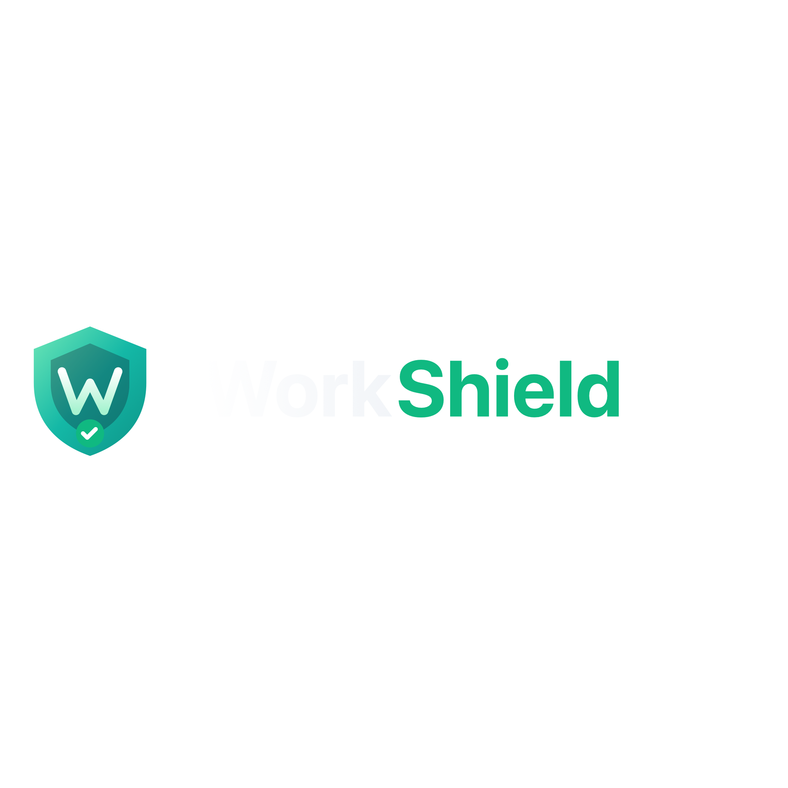

  
 
  <h3 style="color:#94a3b8;">Overview</h3>

 

## Executive Summary

**WorkShield** is a documentation and evidence‑preservation platform designed to help individuals and organizations record workplace incidents accurately and consistently over time.

The product emphasizes **structure, integrity, and user control**. It does not provide legal advice, determine outcomes, or replace professional judgment.

 

## Problem

Workplace incidents are often documented late, inconsistently, or across fragmented tools. This results in lost context, incomplete records, and poor preparedness when information is eventually needed.

Organizations require a neutral system that prioritizes **factual capture, traceability, and intentional sharing** without legal positioning or risk exposure.

---

## Solution

**WorkShield provides:**

* Structured incident documentation workflows
* Secure, centralized storage with integrity controls
* Guided prompts and educational context
* Intentional, user‑controlled exports

The platform is designed to support preparedness and internal clarity while maintaining strict scope boundaries.

---

## Product Structure

### Individual Plans

* Single‑user only
* Personal documentation and evidence organization
* Guided timelines and dashboards
* User‑initiated exports

 

### Managed Access (Organizations)

* Teams of two or more
* Shared workspaces with governance
* Role‑based access and permissions
* Controlled, auditable exports
* Advanced capabilities included by default

 

This separation reflects real‑world usage patterns and reduces risk associated with mixed personal and organizational workflows.

---

## Advanced Capabilities

* Dashboards showing documentation completeness and indicators
* Structured scoring models for internal pattern recognition
* Automated document and letter drafts
* Process awareness views aligned with publicly available information

> All outputs remain **informational only** and fully user‑controlled.

---

## Market Positioning

Not a legal platform

Not case management software

Not advisory or enforcement tooling

This positioning reduces regulatory exposure while addressing a clear documentation and preparedness gap.

---

## Risk & Compliance Posture

* Documentation workflows only
* No legal advice or outcome guarantees
* No automatic third‑party sharing
* Clear AI scope limitations
* User‑controlled access and exports

---

## Status

