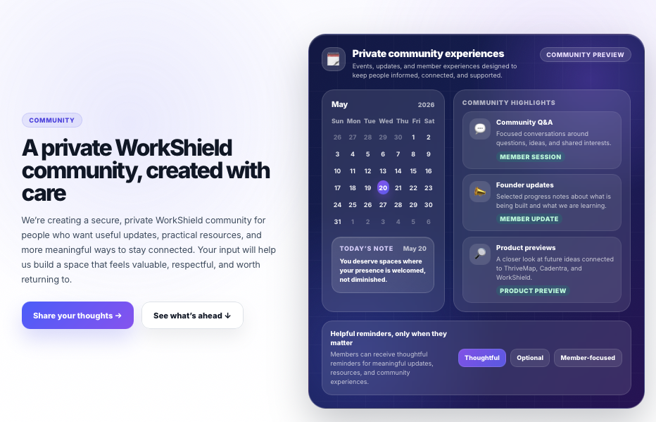

## Private WorkShield Community

  

WorkShield is growing beyond documentation tools. We are preparing a **private community experience** for people who want useful updates, thoughtful resources, and a respectful way to stay connected as the platform moves forward.

This space is being created with intention. It is not meant to feel noisy, performative, or overwhelming. It is meant to feel helpful, steady, and worth returning to.

The WorkShield community may include:

- Clear product updates and progress notes
- Early previews of selected WorkShield improvements
- Practical resources connected to workplace documentation and preparedness
- Opportunities to share feedback about what would feel most useful
- A more personal way to stay connected with the work behind the platform

We are currently inviting feedback from people who care about this kind of space. Your input will help us understand what would make the community genuinely useful, respectful, and supportive.

  <strong>Share what would make this community valuable to you.</strong>

  <a href="https://www.cognitoforms.com/VeyDamneun/WorkShieldPrivateCommunityInterestNeedsSurvey">
    <strong>Submit WorkShield Community Feedback →</strong>
  </a>

