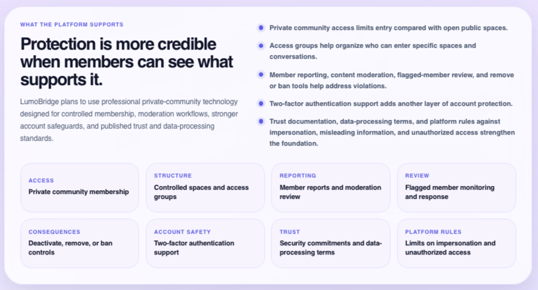

## Private WorkShield Community

  

WorkShield is growing beyond documentation tools. We are preparing a **private community experience** for people who want useful updates, thoughtful resources, and a respectful way to stay connected as the platform moves forward.

This space is being created with care. It is not meant to feel noisy, performative, or overwhelming. It is meant to feel helpful, steady, and worth returning to.

The WorkShield community may include:

- Clear product updates and progress notes
- Early previews of selected WorkShield improvements
- Practical resources connected to workplace documentation and preparedness
- Opportunities to share feedback about what would feel most useful
- A more personal way to stay connected with the work behind the platform

 

### A community designed to feel respectful and protected

  

A meaningful community needs more than access. It needs clear expectations, thoughtful boundaries, and a member experience that feels considered from the start.

WorkShield is approaching this carefully, with a focus on:

- A more private and controlled community setting
- Clear participation expectations
- Member-focused safeguards and review processes
- A calmer space for updates, resources, and feedback
- An experience that respects the seriousness of the topics people may bring with them

We are currently inviting feedback from people who care about this kind of space. Your input will help us understand what would make the community genuinely useful, respectful, and supportive.

  <strong>Share what would make this community valuable to you.</strong>

  <a href="https://www.cognitoforms.com/VeyDamneun/WorkShieldPrivateCommunityInterestNeedsSurvey">
    <strong>Submit WorkShield Community Feedback →</strong>
  </a>

